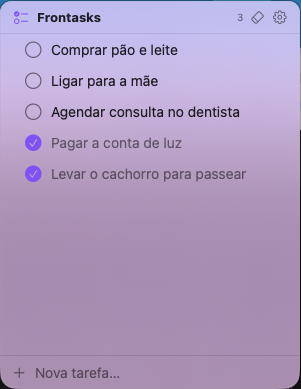
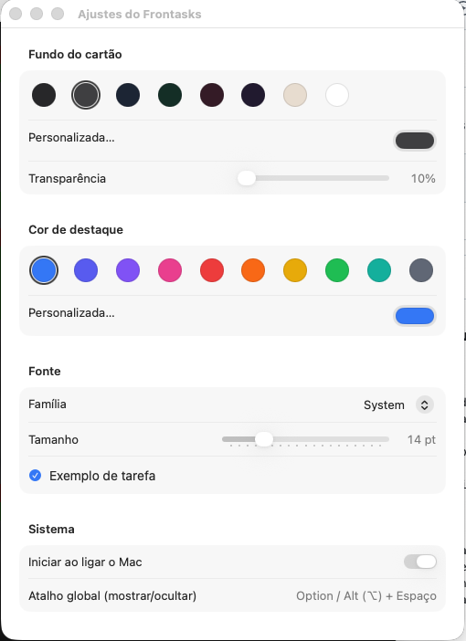
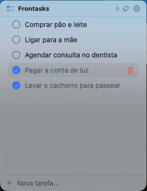
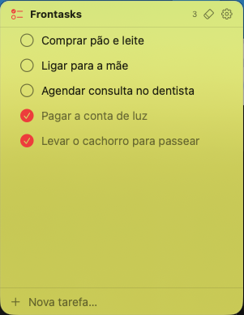

# Frontasks

**Lista de tarefas flutuante e sempre-no-topo — leve, redimensionável e discreta.**

Frontasks é um painel de tarefas que fica *sobre* os outros apps, sempre à vista, sem roubar o foco do que você está fazendo. Sem ícone no Dock/barra de tarefas: só as suas tarefas, num cartão translúcido que você posiciona e dimensiona como quiser.

  

  
  
  

---

## 🖥️ Plataformas

| Plataforma | Status | Onde |
|---|---|---|
| **macOS** (SwiftUI + AppKit) | ✅ **Disponível** — v0.1.0 | [`macos/`](macos/) · [**Baixar (Releases)**](https://github.com/ananiasfilho/frontasks-app/releases) |
| **Linux** (GTK3, foco Mint Cinnamon) | 🚧 **Em desenvolvimento** | [`linux/`](linux/) |

Este é um **monorepo**: cada plataforma tem sua pasta, com implementação nativa e
compatibilidade de dados (mesmo formato de tarefas e preferências).

## ✨ Recursos

- **Sempre no topo**, redimensionável, sem roubar o foco
- Criar, editar, concluir, apagar · **reordenar** arrastando · **limpar concluídas**
- **Atalho global** para mostrar/ocultar
- **Personalização**: cor de destaque, cor de fundo + transparência, cor do texto, fonte e tamanho
- **Iniciar no login** · discreto (fora do Dock/barra de tarefas, só na bandeja/menu)

## 🖼️ Telas (macOS)

  
  &nbsp;&nbsp;
  

  
  
  

## 🚀 Começando

- **macOS:** baixe o `.dmg` em [Releases](https://github.com/ananiasfilho/frontasks-app/releases)
  e arraste para Applications — ou compile do código em [`macos/`](macos/) (sem Xcode, via SwiftPM).
- **Linux:** veja o guia de desenvolvimento em [`linux/`](linux/).

## 📄 Licença

**GNU Affero General Public License v3.0** (AGPL-3.0). Veja [LICENSE](LICENSE).

> Copyright (C) 2026 Ananias Filho
