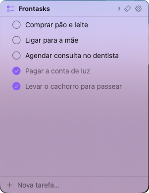

# FronTasks

**Lista de tarefas flutuante e sempre-no-topo para macOS — leve, redimensionável e discreta.**

FronTasks é um painel de tarefas que fica *sobre* os outros apps, sempre à vista, sem roubar o foco do que você está fazendo. Sem ícone no Dock, sem peso: só as suas tarefas, num cartão translúcido que você posiciona e dimensiona como quiser.

<p align="center">
  
</p>

<p align="center">
  
  
  
  
</p>

---

## ✨ Recursos

- **Sempre no topo** — flutua sobre as janelas normais, visível em todos os Spaces.
- **Não rouba o foco** — continue digitando no app de baixo; o painel é não-ativante.
- **Redimensionável e persistente** — arraste as bordas e mova pelo fundo; ele reabre no tamanho e na posição em que você deixou.
- **CRUD completo** — criar, editar (inline), concluir e apagar tarefas.
- **Reordenar** arrastando e **limpar concluídas** de uma vez.
- **Atalho global** — `Option / Alt (⌥) + Espaço` mostra/oculta de qualquer app.
- **Personalização** — cor de destaque, cor de fundo + transparência, fonte e tamanho.
- **Iniciar no login** — via `SMAppService` (API oficial, sem hacks).
- **Discreto** — app *agent* (`LSUIElement`): sem ícone no Dock, só na barra de menus.

## 🖼️ Telas

<p align="center">
  
  &nbsp;&nbsp;
  
</p>

### 🎨 Personalize do seu jeito

Escolha a cor de fundo, a transparência e a cor de destaque — o mesmo app, com a sua cara:

<p align="center">
  
  
  
</p>

## 📥 Instalação

### Homebrew (recomendado)

```bash
brew install --cask ananiasfilho/tap/frontasks
```

### DMG manual

1. Baixe o **`FronTasks-x.y.z.dmg`** mais recente em
   [**Releases**](https://github.com/ananiasfilho/frontasks-app/releases).
2. Abra o `.dmg` e **arraste o FronTasks para a pasta Applications**.
3. Abra o FronTasks pelo Launchpad ou pela pasta Aplicativos.

> **Primeira abertura.** O app é distribuído fora da App Store e assinado apenas
> ad-hoc, então o macOS bloqueia na primeira vez. Para liberar, vá em
> **Ajustes do Sistema → Privacidade e Segurança** e clique em **Abrir Assim Mesmo**,
> ou rode no Terminal:
> ```bash
> xattr -dr com.apple.quarantine /Applications/FronTasks.app
> ```

## 🧰 Requisitos

- macOS 15+ (desenvolvido e testado no macOS 26 *Tahoe*).
- **Command Line Tools** da Apple (`xcode-select --install`) — traz o Swift e o SDK do macOS.
- **Não precisa de Xcode.** Todo o build é via Swift Package Manager.

## 🔨 Como compilar

```bash
# 1. (opcional) gerar o ícone — já vem versionado em Icon/icon.icns
./make-icon.sh

# 2. compilar e empacotar FronTasks.app (assinatura ad-hoc, uso local)
./make-app.sh

# 3. rodar
open FronTasks.app
```

O `make-app.sh` compila em modo release, monta o bundle `.app` com o `Info.plist`
(incluindo `LSUIElement` e o ícone) e assina localmente (ad-hoc).

## 🚀 Uso

- O painel abre automaticamente. Na **primeira vez**, aparece no canto superior
  direito do monitor central.
- **Mostrar/ocultar:** `Option / Alt (⌥) + Espaço`, de qualquer app.
- **Barra de menus:** ícone de checklist → mostrar/ocultar, ajustes, sair.
- **Ajustes:** cor de destaque, cor de fundo + transparência, fonte, tamanho e
  iniciar no login. Também dá para abrir direto:
  `open -n FronTasks.app --args --settings`.

## 🏗️ Arquitetura

Aplicativo nativo, **SwiftUI + AppKit**, sem dependências externas:

- **`FloatingPanel`** — `NSPanel` (`.floating`, `.nonactivatingPanel`,
  `.resizable`) que hospeda a UI SwiftUI via `NSHostingView`.
- **`MenuBarExtra`** + `LSUIElement` — app *agent* sem Dock.
- **`HotKeyManager`** — atalho global via Carbon `RegisterEventHotKey`
  (sem exigir permissão de Acessibilidade).
- **`TaskStore`** — persistência simples em **JSON** (`Codable` +
  `ObservableObject`) em `~/Library/Application Support/FronTasks/tasks.json`.
  *(SwiftData foi descartado de propósito: o macro `@Model` exige um plugin que
  só vem com o Xcode; JSON é mais leve e suficiente.)*
- **Posição/tamanho** — persistidos com `setFrameAutosaveName`.

```
Sources/FronTasks/
├── FronTasksApp.swift     # @main, menu bar, ciclo de vida
├── PanelController.swift  # cria/toggla o painel e a janela de Ajustes
├── FloatingPanel.swift    # NSPanel flutuante
├── HotKeyManager.swift    # atalho global (Carbon)
├── Store.swift            # modelo + store JSON
├── Support/Support.swift  # helpers (cor hex, fonte, paletas)
└── Views/                 # TaskListView, TaskRow, SettingsView
```

## 📄 Licença

Distribuído sob a **GNU Affero General Public License v3.0** (AGPL-3.0).
Veja o arquivo [LICENSE](LICENSE) para o texto completo.

> FronTasks — floating, always-on-top task list for macOS.
> Copyright (C) 2026 Ananias Filho
